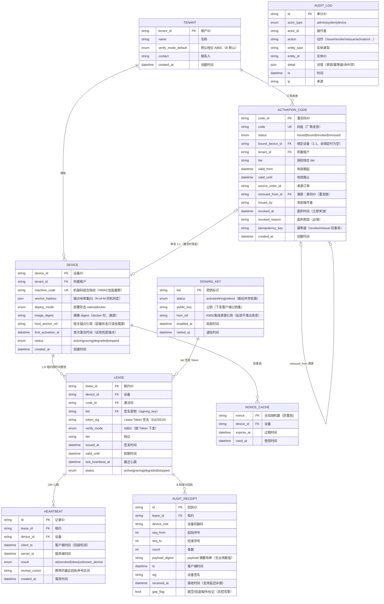

# iot-daq 云端授权数据模型（对应计划 task 44）

> 配套图：`docs/design/licensing-server-and-admin-console.svg`。字段级 API 契约见 `licensing-api.md`（下一轮）。
> 核心关系：**tenant 1:N device；activation_code 1:1 device（可空绑定）；device 1:N lease；lease 1:N heartbeat / audit_receipt；signing_key 1:N lease（kid 签发）**；`nonce_cache`、`audit_log` 为独立支撑表。

## ER 图（9 表）

## 关键设计决策

1. **一机一码**：`activation_code.bound_device_id` 为可空外键，激活时锁定为 1:1；同码异机激活 → 冲突检测（`machine_code` 比对 + `anchor_hashes` N-of-M，task 41）→ 403 `CODE_BOUND_TO_OTHER_DEVICE`；**数据模型不提供任何客户端自行解绑 / 重置接口**。
2. **容器形态（与 task 41/59 口径一致）**：`device.deploy_mode`（native/docker）+ `image_digest` 供运维溯源；容器指纹来自**宿主锚点**（`host_anchor_ref`），**容器重建 / 升级不产生新 device 记录、不触发换机重发**；宿主重装系统 → 锚点变化 → 走后台「废弃 + 重发」。
3. **废弃语义**：`revoked_at` 即时生效（立即失效），`revoked_reason` 必填，原设备最迟下一次心跳被拒（风险窗口 ≤24h，task 42 决议）。
4. **B 档回执与跳空检测**：`audit_receipt` 仅存白名单字段（无业务数值）；服务端按 `seq_from/seq_to` 连续性检测**跳空 / 回退 / 缺失**，置 `gap_flag` → 风控告警（`audit_log`），**人工核实、不自动封禁**；断网允许延迟补报（`received_at` 可晚于 `ts`）。
5. **私钥隔离**：`signing_key` 表只存公钥与 `hsm_ref`（KMS / 离线保管引用），**私钥不落业务数据库、不与业务 API 同一可写位置**；`status` 支持新旧密钥并存轮换（旧客户端仍可验签）。
6. **防重放**：`nonce_cache` 全局唯一约束 + `expires_at` 过期清理；A 档 `/verify` 与激活共用。
7. **档位配置**：租户级默认（`tenant.verify_mode_default`）+ 设备级覆盖（随 Lease Token 下发 `lease.verify_mode`）；切换仅经后台，客户端无档位入口。
8. **审计闭环**：后台全量操作、网关心跳 / 回执、风控告警均写 `audit_log`（actor / action / detail），支撑 admin-console 审计页与溯源时间线。

## 生命周期与状态枚举汇总

| 表 | 状态枚举 | 迁移触发者 |
|----|---------|-----------|
| `activation_code.status` | issued / bound / revoked / reissued | issued→bound：设备首次激活（服务端）；bound/issued→revoked：仅总管理后台；revoked→reissued：仅总管理后台（生成新码） |
| `device.status` | active / gracing / degraded / stopped | 由租约状态机驱动（task 42），服务端心跳结果回写 |
| `lease.status` | active / gracing / degraded / stopped | 心跳结果 + 时间守卫 |
| `signing_key.status` | active / retiring / retired | 密钥轮换流程（后台系统操作） |
